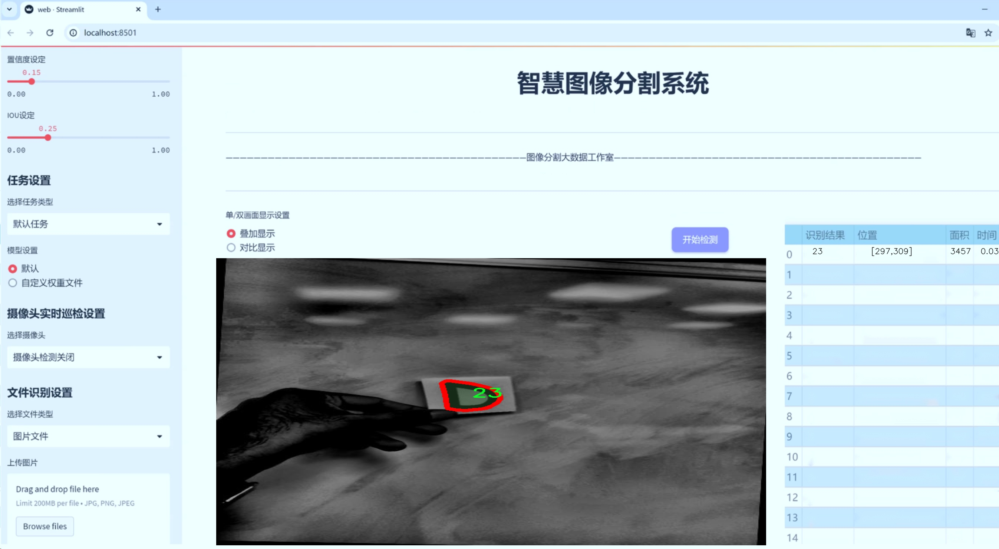
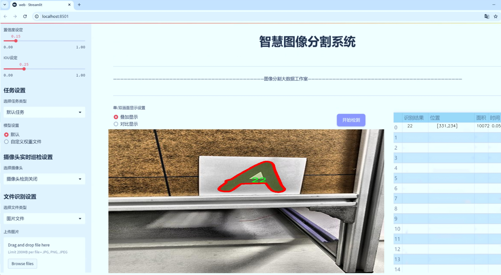
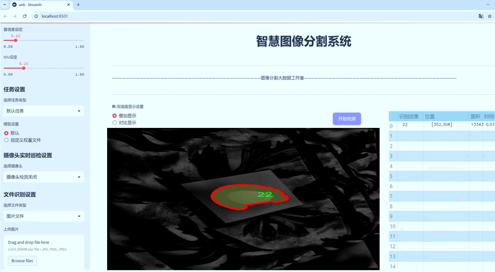
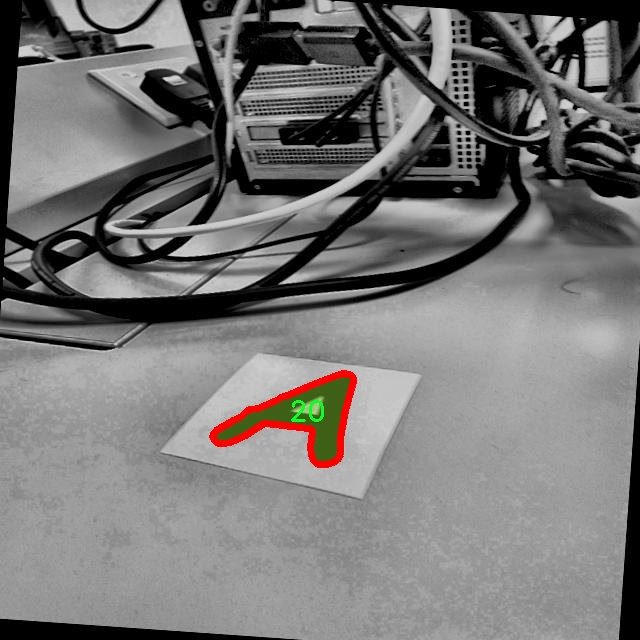
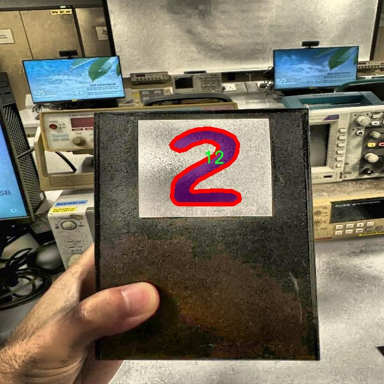
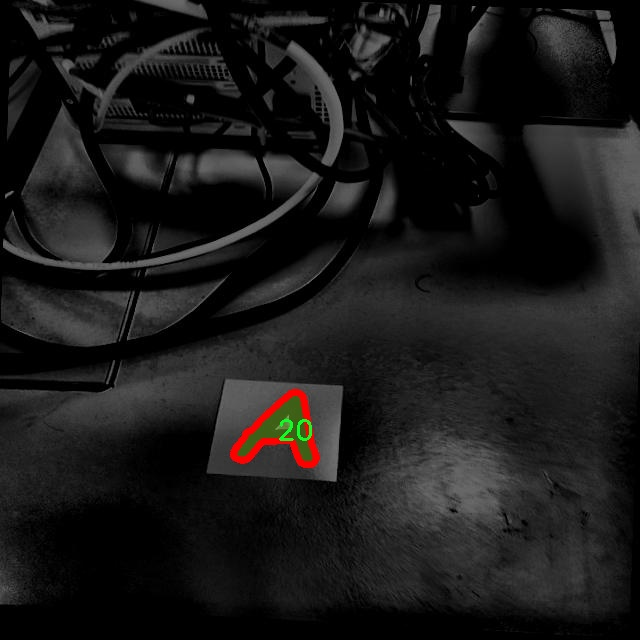
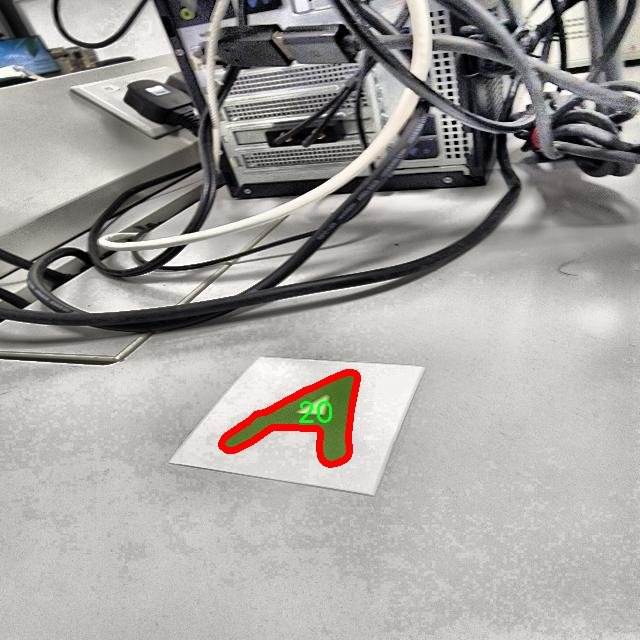
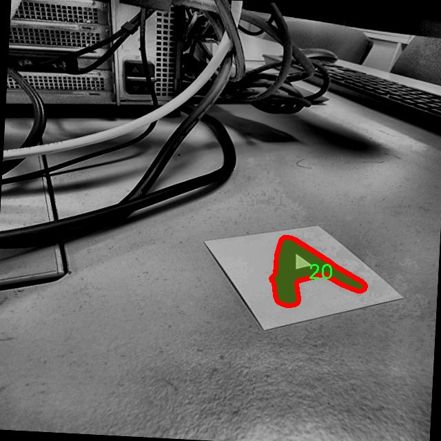

# 字母数字图像分割系统源码＆数据集分享
 [yolov8-seg-C2f-Faster-EMA＆yolov8-seg-C2f-DiverseBranchBlock等50+全套改进创新点发刊_一键训练教程_Web前端展示]

### 1.研究背景与意义

项目参考[ILSVRC ImageNet Large Scale Visual Recognition Challenge](https://gitee.com/YOLOv8_YOLOv11_Segmentation_Studio/projects)

项目来源[AAAI Global Al lnnovation Contest](https://kdocs.cn/l/cszuIiCKVNis)

研究背景与意义

随着信息技术的迅猛发展，图像处理和计算机视觉领域的研究日益受到重视。字母数字图像的分割技术在众多应用场景中发挥着重要作用，如自动化文档处理、车牌识别、二维码扫描等。这些应用不仅提高了工作效率，还推动了智能化社会的进程。因此，开发高效、准确的字母数字图像分割系统具有重要的理论价值和实际意义。

近年来，深度学习技术的快速发展为图像分割任务提供了新的解决方案。其中，YOLO（You Only Look Once）系列模型因其实时性和高精度而受到广泛关注。YOLOv8作为该系列的最新版本，结合了更为先进的网络结构和训练策略，具备了更强的特征提取能力和更高的检测精度。然而，现有的YOLOv8模型在处理复杂背景和多样化字母数字图像时，仍然面临一定的挑战。因此，基于改进YOLOv8的字母数字图像分割系统的研究，旨在通过优化模型结构和训练策略，提升其在特定应用场景下的性能。

本研究所使用的数据集MDP-5包含4600幅图像，涵盖31个类别和11个具体类。这一丰富的数据集为模型的训练和验证提供了坚实的基础。数据集中包含的多样化字母数字图像，不仅包括不同字体、大小和颜色的字母数字，还涵盖了各种复杂背景和噪声。这使得模型在训练过程中能够学习到更为全面的特征，从而提升其在实际应用中的鲁棒性和适应性。

在字母数字图像分割的研究中，实例分割技术尤为重要。与传统的图像分割方法相比，实例分割不仅要求模型识别出图像中的物体，还需对每个物体进行精确的边界划分。这一技术的应用，能够有效提升字母数字信息提取的准确性，进而提高后续处理环节的效率。因此，基于改进YOLOv8的实例分割方法，将为字母数字图像的自动化处理提供新的思路和解决方案。

此外，随着人工智能技术的不断进步，字母数字图像分割的应用场景也在不断扩展。从传统的文档管理到智能交通系统，从工业自动化到智能家居，字母数字信息的提取和处理已成为各个领域的重要组成部分。因此，研究基于改进YOLOv8的字母数字图像分割系统，不仅能够推动相关技术的发展，还将为各行业的智能化转型提供有力支持。

综上所述，基于改进YOLOv8的字母数字图像分割系统的研究，具有重要的理论意义和广泛的应用前景。通过对现有模型的改进和优化，结合丰富的数据集，旨在提升字母数字图像分割的准确性和效率，为未来的智能化应用奠定坚实的基础。

### 2.图片演示







##### 注意：由于此博客编辑较早，上面“2.图片演示”和“3.视频演示”展示的系统图片或者视频可能为老版本，新版本在老版本的基础上升级如下：（实际效果以升级的新版本为准）

  （1）适配了YOLOV8的“目标检测”模型和“实例分割”模型，通过加载相应的权重（.pt）文件即可自适应加载模型。

  （2）支持“图片识别”、“视频识别”、“摄像头实时识别”三种识别模式。

  （3）支持“图片识别”、“视频识别”、“摄像头实时识别”三种识别结果保存导出，解决手动导出（容易卡顿出现爆内存）存在的问题，识别完自动保存结果并导出到tempDir中。

  （4）支持Web前端系统中的标题、背景图等自定义修改，后面提供修改教程。

  另外本项目提供训练的数据集和训练教程,暂不提供权重文件（best.pt）,需要您按照教程进行训练后实现图片演示和Web前端界面演示的效果。

### 3.视频演示

[3.1 视频演示](https://www.bilibili.com/video/BV1Yy27YfEB7/)

### 4.数据集信息展示

##### 4.1 本项目数据集详细数据（类别数＆类别名）

nc: 31
names: ['11', '12', '13', '14', '15', '16', '17', '18', '19', '20', '21', '22', '23', '24', '25', '26', '27', '28', '29', '30', '31', '32', '33', '34', '35', '36', '37', '38', '39', '40', 'marker']


##### 4.2 本项目数据集信息介绍

数据集信息展示

在现代计算机视觉领域，图像分割技术的应用日益广泛，尤其是在字符识别和数字图像处理方面。为了推动这一领域的研究与应用，我们构建了一个名为“MDP-5”的数据集，专门用于训练和改进YOLOv8-seg的字母数字图像分割系统。该数据集的设计旨在提供丰富的样本，以提高模型在复杂场景下的分割精度和鲁棒性。

“MDP-5”数据集包含31个类别，涵盖了从11到40的数字以及一个额外的“marker”类别。这些类别的选择不仅反映了常见的字母数字组合，还包括特定的标记符号，旨在模拟真实世界中可能遇到的各种情况。具体来说，数据集中包含的类别为：11、12、13、14、15、16、17、18、19、20、21、22、23、24、25、26、27、28、29、30、31、32、33、34、35、36、37、38、39、40和marker。这种多样化的类别设置使得数据集能够有效地支持模型对不同字符的识别与分割任务。

在数据集的构建过程中，我们特别注重样本的多样性和代表性。数据集中包含了多种不同的字体、大小、颜色和背景，以确保模型能够在各种环境下进行有效的分割。通过这种方式，我们希望模型不仅能够在理想条件下表现良好，更能在复杂的实际应用场景中保持高效的性能。此外，数据集中的每个图像都经过精确的标注，确保每个字符和标记的边界清晰可辨。这一细致的标注工作为模型的训练提供了坚实的基础，使其能够学习到更为准确的特征。

为了增强数据集的实用性，我们还引入了数据增强技术，包括旋转、缩放、翻转和颜色变换等。这些技术的应用使得数据集在训练过程中能够产生更多的变体，从而提高模型的泛化能力。通过这种方式，模型能够更好地适应不同的输入变化，提升其在实际应用中的表现。

在训练过程中，YOLOv8-seg模型将利用“MDP-5”数据集进行反复迭代，逐步优化其分割算法。模型的训练目标是通过不断调整参数，最大限度地提高对字母数字图像的分割精度。我们期望通过这一过程，最终实现一个高效、准确的字母数字图像分割系统，能够在多种应用场景中发挥作用，如文档分析、车牌识别和自动化数据录入等。

总之，“MDP-5”数据集的构建不仅为YOLOv8-seg模型的训练提供了丰富的素材，也为未来在字母数字图像分割领域的研究提供了重要的基础。我们相信，通过这一数据集的有效利用，能够推动相关技术的进步，促进更广泛的应用落地。











### 5.全套项目环境部署视频教程（零基础手把手教学）

[5.1 环境部署教程链接（零基础手把手教学）](https://www.bilibili.com/video/BV1jG4Ve4E9t/?vd_source=bc9aec86d164b67a7004b996143742dc)


[5.2 安装Python虚拟环境创建和依赖库安装视频教程链接（零基础手把手教学）](https://www.bilibili.com/video/BV1nA4VeYEze/?vd_source=bc9aec86d164b67a7004b996143742dc)

### 6.手把手YOLOV8-seg训练视频教程（零基础小白有手就能学会）

[6.1 手把手YOLOV8-seg训练视频教程（零基础小白有手就能学会）](https://www.bilibili.com/video/BV1cA4VeYETe/?vd_source=bc9aec86d164b67a7004b996143742dc)


按照上面的训练视频教程链接加载项目提供的数据集，运行train.py即可开始训练



     Epoch   gpu_mem       box       obj       cls    labels  img_size
     1/200     0G   0.01576   0.01955  0.007536        22      1280: 100%|██████████| 849/849 [14:42<00:00,  1.04s/it]
               Class     Images     Labels          P          R     mAP@.5 mAP@.5:.95: 100%|██████████| 213/213 [01:14<00:00,  2.87it/s]
                 all       3395      17314      0.994      0.957      0.0957      0.0843

     Epoch   gpu_mem       box       obj       cls    labels  img_size
     2/200     0G   0.01578   0.01923  0.007006        22      1280: 100%|██████████| 849/849 [14:44<00:00,  1.04s/it]
               Class     Images     Labels          P          R     mAP@.5 mAP@.5:.95: 100%|██████████| 213/213 [01:12<00:00,  2.95it/s]
                 all       3395      17314      0.996      0.956      0.0957      0.0845

     Epoch   gpu_mem       box       obj       cls    labels  img_size
     3/200     0G   0.01561    0.0191  0.006895        27      1280: 100%|██████████| 849/849 [10:56<00:00,  1.29it/s]
               Class     Images     Labels          P          R     mAP@.5 mAP@.5:.95: 100%|███████   | 187/213 [00:52<00:00,  4.04it/s]
                 all       3395      17314      0.996      0.957      0.0957      0.0845


### 7.50+种全套YOLOV8-seg创新点代码加载调参视频教程（一键加载写好的改进模型的配置文件）

[7.1 50+种全套YOLOV8-seg创新点代码加载调参视频教程（一键加载写好的改进模型的配置文件）](https://www.bilibili.com/video/BV1Hw4VePEXv/?vd_source=bc9aec86d164b67a7004b996143742dc)

### 8.YOLOV8-seg图像分割算法原理

原始YOLOV8-seg算法原理

YOLO（You Only Look Once）系列算法自诞生以来，便在目标检测领域中占据了重要的地位。YOLOv8作为该系列的最新版本，结合了前几代的优点，并在此基础上进行了创新，尤其是在分割任务（segmentation）方面的应用，形成了YOLOv8-seg算法。该算法不仅在检测精度上得到了显著提升，还通过引入更为高效的网络结构和训练策略，使得目标检测和分割任务的实现更加高效。

YOLOv8-seg的核心思想是将目标检测与实例分割相结合，利用深度学习的强大能力，通过一个统一的框架同时完成目标的定位与分割。与传统的目标检测方法不同，YOLOv8-seg采用了Anchor-free的目标检测方法，这意味着在进行目标位置预测时，不再依赖于预先定义的锚框，而是通过回归的方式直接预测目标的边界框。这种方法不仅简化了模型的设计，也使得网络能够更快地聚焦于目标的实际位置，从而提高了检测的准确性。

在网络结构方面，YOLOv8-seg由主干网络（Backbone）、特征增强网络（Neck）和检测头（Head）三部分组成。主干网络采用了CSP（Cross Stage Partial）结构，利用一系列卷积和反卷积层提取特征，同时引入残差连接和瓶颈结构以减小网络规模并提升性能。主干网络的设计使得YOLOv8-seg能够有效捕捉图像中的重要特征，并为后续的处理提供高质量的特征图。

特征增强网络则采用了PAN-FPN（Path Aggregation Network - Feature Pyramid Network）的思想，通过多尺度特征融合技术，将来自主干网络不同阶段的特征图进行融合。这一过程使得网络能够更好地捕捉不同尺度目标的信息，从而提升了目标检测的性能和鲁棒性。特征增强网络的设计对于处理复杂场景下的目标检测任务尤为重要，因为在实际应用中，目标的尺度和形状往往存在较大差异。

在检测头部分，YOLOv8-seg采用了解耦头的设计，将分类和回归任务分为两个独立的分支。通过这种解耦的方式，各个任务能够更加专注于自身的目标，从而有效解决复杂场景下的定位不准及分类错误的问题。检测头的设计不仅提高了检测的精度，还使得网络在处理不同尺寸的目标时表现得更加灵活。

YOLOv8-seg的训练过程也进行了优化，引入了新的损失函数和数据增强策略，以提高模型的泛化能力和鲁棒性。通过对训练数据的多样化处理，YOLOv8-seg能够在不同的环境和条件下保持良好的性能。此外，YOLOv8-seg还支持自定义模型的训练，使得用户能够根据特定需求进行调整和优化，从而实现更为精准的目标检测和分割。

值得一提的是，YOLOv8-seg在模型的轻量化方面也取得了显著进展。相比于之前的YOLO系列，YOLOv8-seg的权重文件更加轻量化，使得该模型能够在嵌入式设备上进行高效部署。这一特性使得YOLOv8-seg在实时检测的应用场景中表现得尤为出色，能够满足工业、安防、无人驾驶等领域对实时性和准确性的高要求。

综上所述，YOLOv8-seg算法通过引入Anchor-free的目标检测方法、优化的网络结构和高效的训练策略，成功地将目标检测与实例分割任务结合在一起。其在性能、精度和实时性上的显著提升，使得YOLOv8-seg成为当前目标检测领域中的一项重要进展。随着深度学习技术的不断发展，YOLOv8-seg无疑将在更多实际应用中展现出其强大的能力和广泛的适用性。


### 9.系统功能展示（检测对象为举例，实际内容以本项目数据集为准）

图9.1.系统支持检测结果表格显示

  图9.2.系统支持置信度和IOU阈值手动调节

  图9.3.系统支持自定义加载权重文件best.pt(需要你通过步骤5中训练获得)

  图9.4.系统支持摄像头实时识别

  图9.5.系统支持图片识别

  图9.6.系统支持视频识别

  图9.7.系统支持识别结果文件自动保存

  图9.8.系统支持Excel导出检测结果数据


### 10.50+种全套YOLOV8-seg创新点原理讲解（非科班也可以轻松写刊发刊，V11版本正在科研待更新）

#### 10.1 由于篇幅限制，每个创新点的具体原理讲解就不一一展开，具体见下列网址中的创新点对应子项目的技术原理博客网址【Blog】：


[10.1 50+种全套YOLOV8-seg创新点原理讲解链接](https://gitee.com/qunmasj/good)

#### 10.2 部分改进模块原理讲解(完整的改进原理见上图和技术博客链接)【此小节的图要是加载失败请移步原始博客查看，链接：https://blog.csdn.net/cheng2333333?type=blog】

### YOLOv8简介
#### Backbone
Darknet-53
53指的是“52层卷积”+output layer。

借鉴了其他算法的这些设计思想

借鉴了VGG的思想，使用了较多的3×3卷积，在每一次池化操作后，将通道数翻倍；

借鉴了network in network的思想，使用全局平均池化（global average pooling）做预测，并把1×1的卷积核置于3×3的卷积核之间，用来压缩特征；（我没找到这一步体现在哪里）


使用了批归一化层稳定模型训练，加速收敛，并且起到正则化作用。

    以上三点为Darknet19借鉴其他模型的点。Darknet53当然是在继承了Darknet19的这些优点的基础上再新增了下面这些优点的。因此列在了这里

借鉴了ResNet的思想，在网络中大量使用了残差连接，因此网络结构可以设计的很深，并且缓解了训练中梯度消失的问题，使得模型更容易收敛。

使用步长为2的卷积层代替池化层实现降采样。（这一点在经典的Darknet-53上是很明显的，output的长和宽从256降到128，再降低到64，一路降低到8，应该是通过步长为2的卷积层实现的；在YOLOv8的卷积层中也有体现，比如图中我标出的这些位置）

#### 特征融合

模型架构图如下

  Darknet-53的特点可以这样概括：（Conv卷积模块+Residual Block残差块）串行叠加4次

  Conv卷积层+Residual Block残差网络就被称为一个stage


上面红色指出的那个，原始的Darknet-53里面有一层 卷积，在YOLOv8里面，把一层卷积移除了

为什么移除呢？

        原始Darknet-53模型中间加的这个卷积层做了什么？滤波器（卷积核）的个数从 上一个卷积层的512个，先增加到1024个卷积核，然后下一层卷积的卷积核的个数又降低到512个

        移除掉这一层以后，少了1024个卷积核，就可以少做1024次卷积运算，同时也少了1024个3×3的卷积核的参数，也就是少了9×1024个参数需要拟合。这样可以大大减少了模型的参数，（相当于做了轻量化吧）

        移除掉这个卷积层，可能是因为作者发现移除掉这个卷积层以后，模型的score有所提升，所以才移除掉的。为什么移除掉以后，分数有所提高呢？可能是因为多了这些参数就容易，参数过多导致模型在训练集删过拟合，但是在测试集上表现很差，最终模型的分数比较低。你移除掉这个卷积层以后，参数减少了，过拟合现象不那么严重了，泛化能力增强了。当然这个是，拿着你做实验的结论，反过来再找补，再去强行解释这种现象的合理性。


通过MMdetection官方绘制册这个图我们可以看到，进来的这张图片经过一个“Feature Pyramid Network(简称FPN)”，然后最后的P3、P4、P5传递给下一层的Neck和Head去做识别任务。 PAN（Path Aggregation Network）


“FPN是自顶向下，将高层的强语义特征传递下来。PAN就是在FPN的后面添加一个自底向上的金字塔，对FPN补充，将低层的强定位特征传递上去，

FPN是自顶（小尺寸，卷积次数多得到的结果，语义信息丰富）向下（大尺寸，卷积次数少得到的结果），将高层的强语义特征传递下来，对整个金字塔进行增强，不过只增强了语义信息，对定位信息没有传递。PAN就是针对这一点，在FPN的后面添加一个自底（卷积次数少，大尺寸）向上（卷积次数多，小尺寸，语义信息丰富）的金字塔，对FPN补充，将低层的强定位特征传递上去，又被称之为“双塔战术”。

FPN层自顶向下传达强语义特征，而特征金字塔则自底向上传达强定位特征，两两联手，从不同的主干层对不同的检测层进行参数聚合,这样的操作确实很皮。
#### 自底向上增强


而 PAN（Path Aggregation Network）是对 FPN 的一种改进，它的设计理念是在 FPN 后面添加一个自底向上的金字塔。PAN 引入了路径聚合的方式，通过将浅层特征图（低分辨率但语义信息较弱）和深层特征图（高分辨率但语义信息丰富）进行聚合，并沿着特定的路径传递特征信息，将低层的强定位特征传递上去。这样的操作能够进一步增强多尺度特征的表达能力，使得 PAN 在目标检测任务中表现更加优秀。


### Gold-YOLO简介
YOLO系列模型面世至今已有8年，由于其优异的性能，已成为目标检测领域的标杆。在系列模型经过十多个不同版本的改进发展逐渐稳定完善的今天，研究人员更多关注于单个计算模块内结构的精细调整，或是head部分和训练方法上的改进。但这并不意味着现有模式已是最优解。

当前YOLO系列模型通常采用类FPN方法进行信息融合，而这一结构在融合跨层信息时存在信息损失的问题。针对这一问题，我们提出了全新的信息聚集-分发（Gather-and-Distribute Mechanism）GD机制，通过在全局视野上对不同层级的特征进行统一的聚集融合并分发注入到不同层级中，构建更加充分高效的信息交互融合机制，并基于GD机制构建了Gold-YOLO。在COCO数据集中，我们的Gold-YOLO超越了现有的YOLO系列，实现了精度-速度曲线上的SOTA。


精度和速度曲线（TensorRT7）


精度和速度曲线（TensorRT8）
传统YOLO的问题
在检测模型中，通常先经过backbone提取得到一系列不同层级的特征，FPN利用了backbone的这一特点，构建了相应的融合结构：不层级的特征包含着不同大小物体的位置信息，虽然这些特征包含的信息不同，但这些特征在相互融合后能够互相弥补彼此缺失的信息，增强每一层级信息的丰富程度，提升网络性能。

原始的FPN结构由于其层层递进的信息融合模式，使得相邻层的信息能够充分融合，但也导致了跨层信息融合存在问题：当跨层的信息进行交互融合时，由于没有直连的交互通路，只能依靠中间层充当“中介”进行融合，导致了一定的信息损失。之前的许多工作中都关注到了这一问题，而解决方案通常是通过添加shortcut增加更多的路径，以增强信息流动。

然而传统的FPN结构即便改进后，由于网络中路径过多，且交互方式不直接，基于FPN思想的信息融合结构仍然存在跨层信息交互困难和信息损失的问题。

#### Gold-YOLO：全新的信息融合交互机制


#### Gold-YOLO架构
参考该博客提出的一种全新的信息交互融合机制：信息聚集-分发机制(Gather-and-Distribute Mechanism)。该机制通过在全局上融合不同层次的特征得到全局信息，并将全局信息注入到不同层级的特征中，实现了高效的信息交互和融合。在不显著增加延迟的情况下GD机制显著增强了Neck部分的信息融合能力，提高了模型对不同大小物体的检测能力。

GD机制通过三个模块实现：信息对齐模块(FAM)、信息融合模块(IFM)和信息注入模块(Inject)。

信息对齐模块负责收集并对齐不同层级不同大小的特征

信息融合模块通过使用卷积或Transformer算子对对齐后的的特征进行融合，得到全局信息

信息注入模块将全局信息注入到不同层级中

在Gold-YOLO中，针对模型需要检测不同大小的物体的需要，并权衡精度和速度，我们构建了两个GD分支对信息进行融合：低层级信息聚集-分发分支(Low-GD)和高层级信息聚集-分发分支(High-GD)，分别基于卷积和transformer提取和融合特征信息。

此外,为了促进局部信息的流动，我们借鉴现有工作，构建了一个轻量级的邻接层融合模块，该模块在局部尺度上结合了邻近层的特征，进一步提升了模型性能。我们还引入并验证了预训练方法对YOLO模型的有效性，通过在ImageNet 1K上使用MAE方法对主干进行预训练，显著提高了模型的收敛速度和精度。


### 11.项目核心源码讲解（再也不用担心看不懂代码逻辑）

#### 11.1 ultralytics\data\augment.py

以下是对代码中最核心部分的提炼和详细中文注释：

```python
import random
import numpy as np
import cv2

class BaseTransform:
    """
    图像变换的基类。

    该类是一个通用的变换类，可以扩展以满足特定的图像处理需求。
    该类设计为与分类和语义分割任务兼容。
    """

    def __init__(self) -> None:
        """初始化 BaseTransform 对象。"""
        pass

    def apply_image(self, labels):
        """对标签应用图像变换。"""
        pass

    def apply_instances(self, labels):
        """对标签中的对象实例应用变换。"""
        pass

    def apply_semantic(self, labels):
        """对图像应用语义分割变换。"""
        pass

    def __call__(self, labels):
        """对图像、实例和语义掩码应用所有标签变换。"""
        self.apply_image(labels)
        self.apply_instances(labels)
        self.apply_semantic(labels)


class Mosaic(BaseTransform):
    """
    拼接增强类。

    该类通过将多个（4或9）图像组合成一个拼接图像来执行拼接增强。
    增强以给定的概率应用于数据集。
    """

    def __init__(self, dataset, imgsz=640, p=1.0, n=4):
        """初始化拼接对象，设置数据集、图像大小、概率和网格大小。"""
        assert 0 <= p <= 1.0, f'概率应在范围 [0, 1] 内，但得到 {p}。'
        assert n in (4, 9), '网格必须等于 4 或 9。'
        self.dataset = dataset
        self.imgsz = imgsz
        self.border = (-imgsz // 2, -imgsz // 2)  # 边界
        self.n = n

    def get_indexes(self, buffer=True):
        """返回数据集中随机索引的列表。"""
        if buffer:  # 从缓冲区选择图像
            return random.choices(list(self.dataset.buffer), k=self.n - 1)
        else:  # 选择任意图像
            return [random.randint(0, len(self.dataset) - 1) for _ in range(self.n - 1)]

    def _mix_transform(self, labels):
        """对输入图像和标签应用拼接变换。"""
        return self._mosaic4(labels) if self.n == 4 else self._mosaic9(labels)

    def _mosaic4(self, labels):
        """创建 2x2 图像拼接。"""
        mosaic_labels = []
        s = self.imgsz
        yc, xc = (int(random.uniform(-x, 2 * s + x)) for x in self.border)  # 拼接中心 x, y
        for i in range(4):
            labels_patch = labels if i == 0 else labels['mix_labels'][i - 1]
            img = labels_patch['img']
            h, w = labels_patch.pop('resized_shape')

            # 将图像放置在 img4 中
            img4 = np.full((s * 2, s * 2, img.shape[2]), 114, dtype=np.uint8)  # 创建基础图像
            # 计算放置位置
            x1a, y1a, x2a, y2a = self._calculate_position(i, xc, yc, w, h, s)
            img4[y1a:y2a, x1a:x2a] = img[y1b:y2b, x1b:x2b]  # 将图像放入拼接图像中
            mosaic_labels.append(self._update_labels(labels_patch, padw, padh))
        final_labels = self._cat_labels(mosaic_labels)
        final_labels['img'] = img4
        return final_labels

    def _calculate_position(self, i, xc, yc, w, h, s):
        """计算拼接图像中每个小图像的位置。"""
        # 计算每个小图像的放置位置
        # 这里的逻辑根据小图像的索引 i 来决定位置
        # 返回放置位置的坐标
        pass  # 具体实现略去

    def _cat_labels(self, mosaic_labels):
        """返回带有拼接边界实例裁剪的标签。"""
        if len(mosaic_labels) == 0:
            return {}
        cls = []
        instances = []
        imgsz = self.imgsz * 2  # 拼接图像大小
        for labels in mosaic_labels:
            cls.append(labels['cls'])
            instances.append(labels['instances'])
        final_labels = {
            'im_file': mosaic_labels[0]['im_file'],
            'ori_shape': mosaic_labels[0]['ori_shape'],
            'resized_shape': (imgsz, imgsz),
            'cls': np.concatenate(cls, 0),
            'instances': Instances.concatenate(instances, axis=0),
            'mosaic_border': self.border}  # 最终标签
        final_labels['instances'].clip(imgsz, imgsz)
        return final_labels


class RandomPerspective:
    """
    实现随机透视和仿射变换，包括旋转、平移、缩放和剪切。
    """

    def __init__(self, degrees=0.0, translate=0.1, scale=0.5, shear=0.0, perspective=0.0, border=(0, 0)):
        """初始化随机透视对象，设置变换参数。"""
        self.degrees = degrees
        self.translate = translate
        self.scale = scale
        self.shear = shear
        self.perspective = perspective
        self.border = border  # 拼接边界

    def affine_transform(self, img, border):
        """
        应用一系列以图像中心为中心的仿射变换。
        """
        # 计算变换矩阵并应用变换
        pass  # 具体实现略去

    def __call__(self, labels):
        """
        对图像和目标应用仿射变换。
        """
        img = labels['img']
        # 应用变换并更新标签
        pass  # 具体实现略去
```

以上代码是核心的图像增强和变换部分，包括 `BaseTransform` 基类、`Mosaic` 拼接增强类和 `RandomPerspective` 随机透视变换类。每个类都有详细的中文注释，说明其功能和参数。具体实现细节可以根据需要进一步补充。

该文件是Ultralytics YOLO项目中的一个数据增强模块，主要用于图像处理和增强，以提高模型的鲁棒性和泛化能力。文件中定义了多个类和方法，主要用于实现不同类型的图像增强技术，包括图像的组合、混合、随机透视变换、颜色调整、翻转、缩放等。

首先，`BaseTransform`类是一个基础类，提供了图像转换的框架，包含了对图像、实例和语义分割标签的应用方法。`Compose`类则用于将多个转换组合在一起，以便于在一次调用中应用多个增强操作。

`BaseMixTransform`类是一个用于实现混合增强（如MixUp和Mosaic）的基类。`Mosaic`类通过将多个图像（通常是4或9个）组合成一个马赛克图像来实现增强，增强的概率可以设置。`MixUp`类则通过将两张图像混合在一起，生成新的图像。

`RandomPerspective`类实现了随机透视和仿射变换，能够对图像及其对应的边界框、分割和关键点进行旋转、平移、缩放和剪切等操作。该类的构造函数允许用户设置变换的参数，如旋转角度、平移比例、缩放因子等。

`RandomHSV`类负责对图像的色调、饱和度和亮度进行随机调整，增强图像的多样性。`RandomFlip`类则实现了随机的水平或垂直翻转，更新相应的实例（如边界框和关键点）。

`LetterBox`类用于调整图像大小并添加边框，以适应目标检测和实例分割任务。它通过保持图像的纵横比来避免图像失真。

`CopyPaste`类实现了图像的复制粘贴增强，允许从图像中随机选择实例并将其粘贴到其他图像上，以增加训练数据的多样性。

`Albumentations`类是一个可选的增强类，利用Albumentations库提供的多种图像处理功能，如模糊、对比度调整等。

最后，`Format`类用于格式化图像注释，以便在PyTorch的DataLoader中使用，确保图像和实例的格式一致。

文件中还定义了一些用于YOLOv8训练的转换函数，如`v8_transforms`和`classify_transforms`，这些函数组合了不同的增强操作，以适应特定的训练需求。

总体而言，该文件提供了一套完整的图像增强工具，旨在通过多样化训练数据来提高模型的性能。

#### 11.2 ultralytics\utils\torch_utils.py

以下是代码中最核心的部分，并附上详细的中文注释：

```python
import torch
import torch.nn as nn
import torch.nn.functional as F

def select_device(device='', batch=0, newline=False, verbose=True):
    """
    根据提供的参数选择合适的 PyTorch 设备。

    参数:
        device (str | torch.device, optional): 设备字符串或 torch.device 对象。
            选项包括 'None', 'cpu', 'cuda', '0' 或 '0,1,2,3'。默认为空字符串，自动选择
            第一个可用的 GPU，或在没有 GPU 可用时选择 CPU。
        batch (int, optional): 模型使用的批量大小。默认为 0。
        newline (bool, optional): 如果为 True，则在日志字符串末尾添加换行符。默认为 False。
        verbose (bool, optional): 如果为 True，则记录设备信息。默认为 True。

    返回:
        (torch.device): 选择的设备。

    引发:
        ValueError: 如果指定的设备不可用，或者在使用多个 GPU 时批量大小不是设备数量的倍数。

    示例:
        >>> select_device('cuda:0')
        device(type='cuda', index=0)

        >>> select_device('cpu')
        device(type='cpu')
    """
    if isinstance(device, torch.device):
        return device

    device = str(device).lower()
    cpu = device == 'cpu'
    if cpu:
        os.environ['CUDA_VISIBLE_DEVICES'] = '-1'  # 强制 torch.cuda.is_available() = False
    elif device:  # 请求非 CPU 设备
        if device == 'cuda':
            device = '0'
        os.environ['CUDA_VISIBLE_DEVICES'] = device  # 设置环境变量
        if not (torch.cuda.is_available() and torch.cuda.device_count() >= len(device.replace(',', ''))):
            raise ValueError(f"无效的 CUDA 'device={device}' 请求。")

    if not cpu and torch.cuda.is_available():  # 优先使用可用的 GPU
        devices = device.split(',') if device else '0'
        n = len(devices)  # 设备数量
        if n > 1 and batch > 0 and batch % n != 0:  # 检查批量大小是否能被设备数量整除
            raise ValueError(f"'batch={batch}' 必须是 GPU 数量 {n} 的倍数。")
        arg = 'cuda:0'
    else:  # 回退到 CPU
        arg = 'cpu'

    return torch.device(arg)

def fuse_conv_and_bn(conv, bn):
    """融合 Conv2d() 和 BatchNorm2d() 层。"""
    fusedconv = nn.Conv2d(conv.in_channels,
                          conv.out_channels,
                          kernel_size=conv.kernel_size,
                          stride=conv.stride,
                          padding=conv.padding,
                          dilation=conv.dilation,
                          groups=conv.groups,
                          bias=True).requires_grad_(False).to(conv.weight.device)

    # 准备过滤器
    w_conv = conv.weight.clone().view(conv.out_channels, -1)
    w_bn = torch.diag(bn.weight.div(torch.sqrt(bn.eps + bn.running_var)))
    fusedconv.weight.copy_(torch.mm(w_bn, w_conv).view(fusedconv.weight.shape))

    # 准备空间偏置
    b_conv = torch.zeros(conv.weight.size(0), device=conv.weight.device) if conv.bias is None else conv.bias
    b_bn = bn.bias - bn.weight.mul(bn.running_mean).div(torch.sqrt(bn.running_var + bn.eps))
    fusedconv.bias.copy_(torch.mm(w_bn, b_conv.reshape(-1, 1)).reshape(-1) + b_bn)

    return fusedconv

def initialize_weights(model):
    """初始化模型权重为随机值。"""
    for m in model.modules():
        if isinstance(m, nn.Conv2d):
            nn.init.kaiming_normal_(m.weight, mode='fan_out', nonlinearity='relu')  # Kaiming 初始化
        elif isinstance(m, nn.BatchNorm2d):
            m.eps = 1e-3
            m.momentum = 0.03

def time_sync():
    """PyTorch 精确时间同步。"""
    if torch.cuda.is_available():
        torch.cuda.synchronize()  # 确保所有 GPU 操作完成
    return time.time()

class EarlyStopping:
    """早停类，当指定的 epoch 数量过去而没有改进时停止训练。"""

    def __init__(self, patience=50):
        """初始化早停对象。

        参数:
            patience (int, optional): 在没有改进的情况下等待的 epoch 数量。
        """
        self.best_fitness = 0.0  # 最佳适应度
        self.best_epoch = 0
        self.patience = patience or float('inf')  # 在没有改进的情况下等待的 epoch 数量
        self.possible_stop = False  # 可能在下一个 epoch 停止

    def __call__(self, epoch, fitness):
        """检查是否停止训练。

        参数:
            epoch (int): 当前训练的 epoch
            fitness (float): 当前 epoch 的适应度值

        返回:
            (bool): 如果应该停止训练则返回 True，否则返回 False
        """
        if fitness is None:  # 检查 fitness=None
            return False

        if fitness >= self.best_fitness:  # 允许在训练的早期阶段有零适应度
            self.best_epoch = epoch
            self.best_fitness = fitness
        delta = epoch - self.best_epoch  # 没有改进的 epoch 数量
        stop = delta >= self.patience  # 如果超过耐心则停止训练
        if stop:
            print(f'早停训练，因为在过去的 {self.patience} 个 epoch 中没有观察到改进。')
        return stop
```

以上代码是核心功能部分，主要包括设备选择、卷积和批归一化层的融合、权重初始化、时间同步以及早停机制的实现。每个函数和类都有详细的中文注释，便于理解其功能和使用方法。

这个程序文件 `torch_utils.py` 是 Ultralytics YOLO 项目的一部分，主要用于处理与 PyTorch 相关的工具函数和类。文件中包含了一系列用于模型训练、推理、设备选择、性能分析等功能的实现。

首先，文件导入了一些必要的库，包括数学运算、操作系统、随机数生成、时间处理、上下文管理、深拷贝、路径处理以及类型提示等。此外，还导入了 NumPy 和 PyTorch 相关的模块，如 `torch.distributed`、`torch.nn` 和 `torch.nn.functional`，以便于后续的深度学习模型构建和训练。

文件中定义了多个函数和类，以下是一些关键功能的说明：

1. **分布式训练支持**：`torch_distributed_zero_first` 是一个上下文管理器，用于在分布式训练中确保所有进程在本地主进程完成某些操作之前等待。

2. **智能推理模式**：`smart_inference_mode` 函数根据 PyTorch 的版本选择合适的推理模式装饰器，以提高推理效率。

3. **设备选择**：`select_device` 函数用于选择合适的 PyTorch 设备（CPU 或 GPU），并根据可用设备和批量大小进行验证。它还会设置环境变量 `CUDA_VISIBLE_DEVICES` 来指定使用的 GPU。

4. **时间同步**：`time_sync` 函数用于确保在多 GPU 环境下的时间同步，确保时间测量的准确性。

5. **模型信息**：`model_info` 函数提供了关于模型的详细信息，包括参数数量、梯度数量和层数，并可以选择是否输出详细信息。

6. **参数和梯度统计**：`get_num_params` 和 `get_num_gradients` 函数分别用于获取模型的总参数数量和具有梯度的参数数量。

7. **模型权重初始化**：`initialize_weights` 函数用于初始化模型的权重，设置 BatchNorm 的参数。

8. **图像缩放和填充**：`scale_img` 函数用于根据给定的比例和网格大小缩放和填充图像张量。

9. **模型性能分析**：`get_flops` 和 `get_flops_with_torch_profiler` 函数用于计算模型的浮点运算次数（FLOPs），帮助评估模型的计算复杂度。

10. **早停机制**：`EarlyStopping` 类用于在训练过程中监控模型的性能，并在若干个周期内没有改进时提前停止训练。

11. **优化器剥离**：`strip_optimizer` 函数用于从训练好的模型中剥离优化器，以便于模型的部署和推理。

12. **性能分析工具**：`profile` 函数用于分析模型的速度、内存使用和 FLOPs，提供了对模型性能的详细报告。

整个文件的设计旨在提供高效、灵活的工具，以支持 YOLO 模型的训练和推理，尤其是在处理大规模数据和复杂模型时。通过这些工具，用户可以更方便地进行模型的调试、优化和部署。

#### 11.3 ui.py

以下是保留的核心代码部分，并附上详细的中文注释：

```python
import sys
import subprocess

def run_script(script_path):
    """
    使用当前 Python 环境运行指定的脚本。

    Args:
        script_path (str): 要运行的脚本路径

    Returns:
        None
    """
    # 获取当前 Python 解释器的路径
    python_path = sys.executable

    # 构建运行命令，使用 streamlit 运行指定的脚本
    command = f'"{python_path}" -m streamlit run "{script_path}"'

    # 执行命令，并等待其完成
    result = subprocess.run(command, shell=True)
    
    # 检查命令执行的返回码，如果不为0，表示出错
    if result.returncode != 0:
        print("脚本运行出错。")

# 实例化并运行应用
if __name__ == "__main__":
    # 指定要运行的脚本路径
    script_path = "web.py"  # 假设脚本在当前目录下

    # 调用函数运行脚本
    run_script(script_path)
```

### 注释说明：
1. **导入模块**：
   - `sys`：用于获取当前 Python 解释器的路径。
   - `subprocess`：用于执行外部命令。

2. **`run_script` 函数**：
   - 接受一个参数 `script_path`，表示要运行的 Python 脚本的路径。
   - 使用 `sys.executable` 获取当前 Python 解释器的路径。
   - 构建一个命令字符串，使用 `streamlit` 模块运行指定的脚本。
   - 使用 `subprocess.run` 执行构建的命令，并等待其完成。
   - 检查命令的返回码，如果返回码不为0，表示脚本运行出错，打印错误信息。

3. **主程序块**：
   - 在 `__name__` 为 `"__main__"` 时执行，确保只有在直接运行该脚本时才会执行。
   - 指定要运行的脚本路径为 `"web.py"`。
   - 调用 `run_script` 函数，传入脚本路径以执行该脚本。

这个程序文件名为 `ui.py`，主要功能是使用当前的 Python 环境来运行一个指定的脚本，具体是通过 Streamlit 框架来启动一个 Web 应用。

首先，程序导入了几个必要的模块，包括 `sys`、`os` 和 `subprocess`。其中，`sys` 模块用于访问与 Python 解释器相关的变量和函数，`os` 模块提供了与操作系统交互的功能，而 `subprocess` 模块则用于创建新进程、连接到它们的输入/输出/错误管道，并获取它们的返回码。

接下来，程序从 `QtFusion.path` 模块中导入了 `abs_path` 函数，这个函数的作用是获取文件的绝对路径。

在 `run_script` 函数中，程序接受一个参数 `script_path`，这个参数是要运行的脚本的路径。函数首先获取当前 Python 解释器的路径，并将其存储在 `python_path` 变量中。然后，构建一个命令字符串，使用 `streamlit run` 命令来运行指定的脚本。这个命令的格式是将 Python 解释器的路径和脚本路径组合成一个完整的命令。

接着，程序使用 `subprocess.run` 方法来执行这个命令，并将 `shell` 参数设置为 `True`，这意味着命令将在一个新的 shell 中运行。执行完命令后，程序检查返回码，如果返回码不为 0，表示脚本运行出错，程序会打印出相应的错误信息。

在文件的最后部分，程序通过 `if __name__ == "__main__":` 判断当前模块是否是主程序。如果是主程序，则指定要运行的脚本路径为 `web.py`，并调用 `run_script` 函数来执行这个脚本。

总的来说，这个程序的主要目的是提供一个简单的接口，通过命令行运行一个基于 Streamlit 的 Web 应用，便于开发和测试。

#### 11.4 train.py

以下是代码中最核心的部分，并附上详细的中文注释：

```python
import os
import torch
import yaml
from ultralytics import YOLO  # 导入YOLO模型库

if __name__ == '__main__':  # 确保该模块被直接运行时才执行以下代码
    # 设置训练参数
    workers = 1  # 数据加载的工作进程数
    batch = 8  # 每个批次的样本数量
    device = "0" if torch.cuda.is_available() else "cpu"  # 判断是否使用GPU

    # 获取数据集的yaml配置文件的绝对路径
    data_path = abs_path(f'datasets/data/data.yaml', path_type='current')

    # 将路径格式转换为Unix风格
    unix_style_path = data_path.replace(os.sep, '/')
    # 获取目录路径
    directory_path = os.path.dirname(unix_style_path)

    # 读取YAML文件，保持原有顺序
    with open(data_path, 'r') as file:
        data = yaml.load(file, Loader=yaml.FullLoader)

    # 修改YAML文件中的训练、验证和测试数据路径
    if 'train' in data and 'val' in data and 'test' in data:
        data['train'] = directory_path + '/train'  # 设置训练数据路径
        data['val'] = directory_path + '/val'      # 设置验证数据路径
        data['test'] = directory_path + '/test'    # 设置测试数据路径

        # 将修改后的数据写回YAML文件
        with open(data_path, 'w') as file:
            yaml.safe_dump(data, file, sort_keys=False)

    # 加载YOLO模型配置文件和预训练权重
    model = YOLO(r"C:\codeseg\codenew\50+种YOLOv8算法改进源码大全和调试加载训练教程（非必要）\改进YOLOv8模型配置文件\yolov8-seg-C2f-Faster.yaml").load("./weights/yolov8s-seg.pt")

    # 开始训练模型
    results = model.train(
        data=data_path,  # 指定训练数据的配置文件路径
        device=device,  # 指定使用的设备（GPU或CPU）
        workers=workers,  # 指定数据加载的工作进程数
        imgsz=640,  # 指定输入图像的大小为640x640
        epochs=100,  # 指定训练的轮数为100
        batch=batch,  # 指定每个批次的样本数量
    )
```

### 代码注释说明：
1. **导入必要的库**：导入了操作系统相关的库、PyTorch库、YAML解析库和YOLO模型库。
2. **主程序入口**：使用`if __name__ == '__main__':`确保只有在直接运行该脚本时才会执行后续代码。
3. **设置训练参数**：定义了数据加载的工作进程数、批次大小和设备类型（GPU或CPU）。
4. **获取数据集路径**：通过`abs_path`函数获取数据集配置文件的绝对路径，并将其转换为Unix风格路径。
5. **读取和修改YAML文件**：读取YAML文件内容，修改训练、验证和测试数据的路径，并将修改后的内容写回YAML文件。
6. **加载YOLO模型**：指定模型的配置文件和预训练权重，加载YOLO模型。
7. **开始训练模型**：调用`model.train`方法开始训练，传入训练数据路径、设备、工作进程数、图像大小、训练轮数和批次大小等参数。

该程序文件 `train.py` 是一个用于训练 YOLO（You Only Look Once）模型的脚本。首先，它导入了必要的库，包括操作系统库 `os`、深度学习框架 `torch`、YAML 处理库 `yaml` 以及 YOLO 模型库 `ultralytics`。同时，它还设置了 Matplotlib 的后端为 TkAgg，以便于图形显示。

在 `__main__` 代码块中，程序首先定义了一些训练参数，包括工作进程数 `workers` 和批次大小 `batch`。批次大小的设置可以根据计算机的显存和内存进行调整，如果显存不足，可以适当降低该值。接着，程序判断当前是否有可用的 GPU，如果有，则将设备设置为 "0"（表示使用第一个 GPU），否则使用 CPU。

接下来，程序构建了数据集配置文件的绝对路径，并将路径中的分隔符统一为 Unix 风格的斜杠。然后，程序读取指定路径下的 YAML 文件，获取数据集的配置信息。它检查 YAML 文件中是否包含 'train'、'val' 和 'test' 三个字段，如果存在，则将这些字段的路径修改为当前目录下的相应子目录，并将修改后的数据写回 YAML 文件。

程序还提醒用户，不同的模型对设备的要求不同，如果在训练过程中遇到错误，可以尝试使用其他模型配置文件进行测试。接着，程序加载了一个预训练的 YOLOv8 模型，指定了模型的配置文件和权重文件。

最后，程序调用 `model.train()` 方法开始训练模型，传入训练数据的配置文件路径、设备、工作进程数、输入图像大小、训练的 epoch 数量以及批次大小等参数。这一系列步骤构成了一个完整的训练流程，旨在利用指定的数据集和模型配置进行目标检测或分割任务的训练。

#### 11.5 ultralytics\utils\checks.py

以下是代码中最核心的部分，并附上详细的中文注释：

```python
import os
import platform
import subprocess
import sys
from pathlib import Path
from typing import Optional

import torch
from ultralytics.utils import LOGGER, ROOT, colorstr, TryExcept, is_pip_package, is_online

def check_python(minimum: str = '3.8.0') -> bool:
    """
    检查当前 Python 版本是否满足最低要求。

    参数:
        minimum (str): 要求的最低 Python 版本。

    返回:
        bool: 如果当前版本满足要求则返回 True，否则返回 False。
    """
    current_version = platform.python_version()  # 获取当前 Python 版本
    if current_version < minimum:
        LOGGER.warning(f'WARNING ⚠️ 当前 Python 版本 {current_version} 不满足最低要求 {minimum}。')
        return False
    return True

@TryExcept()
def check_requirements(requirements=ROOT.parent / 'requirements.txt', exclude=(), install=True, cmds=''):
    """
    检查已安装的依赖项是否满足要求，并尝试自动更新。

    参数:
        requirements (Union[Path, str, List[str]]): requirements.txt 文件的路径，单个包要求的字符串，或包要求的字符串列表。
        exclude (Tuple[str]): 要排除的包名称元组。
        install (bool): 如果为 True，尝试自动更新不满足要求的包。
        cmds (str): 在自动更新时传递给 pip install 命令的附加命令。

    返回:
        bool: 如果所有要求都满足则返回 True，否则返回 False。
    """
    check_python()  # 检查 Python 版本
    if isinstance(requirements, Path):  # 如果是 requirements.txt 文件
        file = requirements.resolve()
        assert file.exists(), f'requirements.txt 文件 {file} 未找到，检查失败。'
        requirements = [f'{x.name}{x.specifier}' for x in parse_requirements(file) if x.name not in exclude]
    elif isinstance(requirements, str):
        requirements = [requirements]

    pkgs = []  # 存储不满足要求的包
    for r in requirements:
        try:
            assert check_version(metadata.version(r), required)  # 检查版本是否满足要求
        except (AssertionError, metadata.PackageNotFoundError):
            pkgs.append(r)  # 如果不满足要求，添加到 pkgs 列表

    if pkgs and install and is_online():  # 如果有不满足要求的包且允许自动更新
        LOGGER.info(f"尝试自动更新以下包: {pkgs}...")
        try:
            subprocess.check_output(f'pip install --no-cache {s} {cmds}', shell=True).decode()
            LOGGER.info(f"自动更新成功，已安装包: {pkgs}")
        except Exception as e:
            LOGGER.warning(f'自动更新失败: {e}')
            return False

    return True

def check_cuda() -> bool:
    """
    检查环境中是否可用 CUDA。

    返回:
        bool: 如果可用则返回 True，否则返回 False。
    """
    try:
        output = subprocess.check_output(['nvidia-smi', '--query-gpu=count', '--format=csv,noheader,nounits'],
                                         encoding='utf-8')
        return int(output.strip()) > 0  # 检查输出是否大于 0
    except (subprocess.CalledProcessError, FileNotFoundError):
        return False  # 如果命令失败或未找到，返回 False

# 其他辅助函数和类省略...
```

### 代码说明
1. **check_python**: 该函数用于检查当前 Python 版本是否满足指定的最低版本要求。如果不满足，则会记录警告信息并返回 False。

2. **check_requirements**: 该函数用于检查项目所需的依赖包是否已安装并满足版本要求。如果有不满足要求的包，且允许自动更新，则会尝试使用 pip 更新这些包。

3. **check_cuda**: 该函数用于检查系统中是否有可用的 NVIDIA GPU。如果可用，返回 True；否则返回 False。

这些函数是代码的核心部分，确保了运行环境的正确性和依赖的完整性。

这个程序文件 `ultralytics/utils/checks.py` 是一个用于检查和验证与 Ultralytics YOLO 模型相关的各种条件和环境设置的工具库。它主要包括以下几个方面的功能：

首先，文件导入了一系列必要的库，包括标准库和第三方库，如 `cv2`、`numpy`、`requests` 和 `torch`。这些库提供了处理图像、进行网络请求、操作张量等功能。

文件中定义了多个函数，每个函数都有特定的用途。比如，`parse_requirements` 函数用于解析 `requirements.txt` 文件，提取出所需的 Python 包及其版本要求。这个函数会忽略以 `#` 开头的注释行，并将每一行解析为一个字典，包含包名和版本说明。

`parse_version` 函数则将版本字符串转换为一个整数元组，方便进行版本比较。它能够处理如 `2.0.1+cpu` 这样的版本字符串，并返回 `(2, 0, 1)` 这样的元组。

`is_ascii` 函数用于检查一个字符串是否仅由 ASCII 字符组成。这个检查在处理字符串时非常有用，尤其是在需要确保兼容性时。

`check_imgsz` 函数验证图像尺寸是否为给定步幅的倍数，并根据需要调整图像尺寸。这个函数确保输入的图像尺寸符合模型的要求，避免因尺寸不匹配而导致的错误。

`check_version` 函数用于检查当前版本是否满足所需版本的要求。它支持多种比较操作符（如 `==`、`>=`、`<=` 等），并可以选择在不满足条件时抛出异常或打印警告信息。

`check_latest_pypi_version` 函数则查询 PyPI 上指定包的最新版本，方便用户了解是否有更新可用。

`check_requirements` 函数检查安装的依赖是否满足 YOLOv8 的要求，并在需要时尝试自动更新。它可以处理单个包、多个包或一个 requirements 文件。

`check_torchvision` 函数检查安装的 PyTorch 和 Torchvision 版本是否兼容，并根据兼容性表发出警告。

此外，文件中还有一些函数用于检查文件的后缀、验证字体是否存在、检查 Python 版本、收集系统信息、检查 CUDA 可用性等。这些功能使得用户能够快速验证其环境是否适合运行 YOLO 模型。

最后，文件中还包含了一些与 YOLO 模型相关的特定检查，例如 `check_amp` 函数用于检查 PyTorch 的自动混合精度（AMP）功能是否正常，确保在训练过程中不会出现 NaN 损失或零 mAP 结果。

总的来说，这个文件是一个全面的检查工具，确保用户的环境和依赖项符合运行 Ultralytics YOLO 模型的要求，从而提高了模型的稳定性和可靠性。

#### 11.6 ultralytics\data\annotator.py

以下是代码中最核心的部分，并附上详细的中文注释：

```python
from pathlib import Path
from ultralytics import SAM, YOLO

def auto_annotate(data, det_model='yolov8x.pt', sam_model='sam_b.pt', device='', output_dir=None):
    """
    自动标注图像，使用YOLO目标检测模型和SAM分割模型。

    参数:
        data (str): 包含待标注图像的文件夹路径。
        det_model (str, optional): 预训练的YOLO检测模型。默认为'yolov8x.pt'。
        sam_model (str, optional): 预训练的SAM分割模型。默认为'sam_b.pt'。
        device (str, optional): 运行模型的设备。默认为空字符串（使用CPU或可用的GPU）。
        output_dir (str | None | optional): 保存标注结果的目录。
            默认为与'data'相同目录下的'labels'文件夹。

    示例:
        auto_annotate(data='ultralytics/assets', det_model='yolov8n.pt', sam_model='mobile_sam.pt')
    """
    # 加载YOLO目标检测模型
    det_model = YOLO(det_model)
    # 加载SAM分割模型
    sam_model = SAM(sam_model)

    # 将数据路径转换为Path对象
    data = Path(data)
    # 如果未指定输出目录，则创建一个默认的输出目录
    if not output_dir:
        output_dir = data.parent / f'{data.stem}_auto_annotate_labels'
    # 创建输出目录（如果不存在）
    Path(output_dir).mkdir(exist_ok=True, parents=True)

    # 使用YOLO模型进行目标检测，返回检测结果
    det_results = det_model(data, stream=True, device=device)

    # 遍历每个检测结果
    for result in det_results:
        # 获取检测到的类别ID
        class_ids = result.boxes.cls.int().tolist()  # noqa
        # 如果检测到的类别ID不为空
        if len(class_ids):
            # 获取边界框坐标
            boxes = result.boxes.xyxy  # 边界框输出对象
            # 使用SAM模型进行分割，传入边界框
            sam_results = sam_model(result.orig_img, bboxes=boxes, verbose=False, save=False, device=device)
            # 获取分割结果
            segments = sam_results[0].masks.xyn  # noqa

            # 将分割结果写入文本文件
            with open(f'{str(Path(output_dir) / Path(result.path).stem)}.txt', 'w') as f:
                for i in range(len(segments)):
                    s = segments[i]
                    # 如果分割结果为空，则跳过
                    if len(s) == 0:
                        continue
                    # 将分割结果转换为字符串并写入文件
                    segment = map(str, segments[i].reshape(-1).tolist())
                    f.write(f'{class_ids[i]} ' + ' '.join(segment) + '\n')
```

### 代码核心部分说明：
1. **模型加载**：加载YOLO和SAM模型以进行目标检测和图像分割。
2. **路径处理**：使用`Path`对象处理文件路径，确保输出目录存在。
3. **目标检测**：使用YOLO模型对指定路径下的图像进行目标检测，获取检测结果。
4. **图像分割**：对于每个检测结果，使用SAM模型进行图像分割，提取分割结果。
5. **结果保存**：将分割结果和对应的类别ID写入文本文件，便于后续使用。

这个程序文件是一个用于自动标注图像的脚本，主要利用YOLO（You Only Look Once）目标检测模型和SAM（Segment Anything Model）分割模型来实现。其核心功能是对指定文件夹中的图像进行处理，生成相应的标注结果。

首先，程序导入了必要的库，包括`Path`用于处理文件路径，以及`SAM`和`YOLO`这两个模型类。接着定义了一个名为`auto_annotate`的函数，该函数接受多个参数：

- `data`：一个字符串，表示包含待标注图像的文件夹路径。
- `det_model`：一个可选参数，指定使用的YOLO检测模型，默认值为'yolov8x.pt'。
- `sam_model`：一个可选参数，指定使用的SAM分割模型，默认值为'sam_b.pt'。
- `device`：一个可选参数，指定运行模型的设备（CPU或GPU），默认为空字符串。
- `output_dir`：一个可选参数，指定保存标注结果的目录，默认是在`data`路径下创建一个名为'labels'的文件夹。

在函数内部，首先实例化YOLO和SAM模型。然后将输入的`data`路径转换为`Path`对象，接着检查`output_dir`是否被指定，如果没有，则创建一个新的输出目录，该目录的名称基于输入数据的文件夹名称。

接下来，使用YOLO模型对输入数据进行检测，结果以流的形式返回。对于每个检测结果，提取出类别ID和边界框（bounding boxes）。如果检测到的类别ID不为空，则使用SAM模型对原始图像和边界框进行分割，得到分割结果。

最后，程序将分割结果写入文本文件中，文件名与原始图像相同，后缀为`.txt`。每一行包含类别ID和对应的分割坐标，坐标以空格分隔。

总的来说，这段代码实现了从图像中自动提取目标并生成相应的分割标注，便于后续的图像处理和分析。

### 12.系统整体结构（节选）

### 整体功能和构架概括

Ultralytics YOLO 项目是一个用于目标检测和图像分割的深度学习框架，旨在提供高效、灵活的工具来训练和推理 YOLO 模型。该项目的整体架构包括多个模块，每个模块负责特定的功能，如数据增强、模型训练、推理、验证、标注等。以下是各个模块的主要功能概述：

- **数据处理**：包括数据增强、标注生成和数据转换等功能，以准备高质量的训练数据。
- **模型训练与验证**：提供训练和验证模型的工具，支持多种配置和参数设置。
- **工具函数**：包括设备选择、性能分析、环境检查等，确保模型的顺利运行。
- **用户界面**：提供简单的命令行界面或 Web 界面，以便于用户与模型进行交互。
- **模型推理**：实现对新图像的目标检测和分割功能。

### 文件功能整理表

| 文件路径                                         | 功能描述                                                                                       |
|--------------------------------------------------|-----------------------------------------------------------------------------------------------|
| `ultralytics/data/augment.py`                   | 实现图像数据增强功能，包括多种增强技术，如随机翻转、颜色调整、混合增强等。                     |
| `ultralytics/utils/torch_utils.py`              | 提供与 PyTorch 相关的工具函数，如设备选择、模型信息、性能分析等。                             |
| `ui.py`                                         | 启动一个基于 Streamlit 的 Web 应用，用于运行指定的脚本，便于用户交互。                         |
| `train.py`                                      | 负责训练 YOLO 模型，加载数据集配置，设置训练参数并调用训练方法。                             |
| `ultralytics/utils/checks.py`                   | 检查和验证环境设置、依赖项和版本，确保运行 YOLO 模型的环境符合要求。                          |
| `ultralytics/data/annotator.py`                 | 自动标注图像，利用 YOLO 和 SAM 模型生成分割标注结果并保存到文件。                             |
| `ultralytics/engine/validator.py`               | 提供模型验证功能，评估模型在验证集上的性能，计算各种指标如 mAP。                             |
| `ultralytics/models/yolo/detect/train.py`       | 实现 YOLO 模型的训练逻辑，定义训练过程中的损失计算、优化器设置等。                           |
| `ultralytics/models/yolo/__init__.py`           | YOLO 模型的初始化文件，可能包含模型类的定义和导入。                                          |
| `ultralytics/data/converter.py`                  | 数据转换工具，将不同格式的数据转换为模型所需的格式。                                         |
| `ultralytics/utils/atss.py`                     | 实现 ATSS（Adaptive Training Sample Selection）相关功能，优化训练样本选择。                   |
| `ultralytics/models/fastsam/__init__.py`        | FastSAM 模型的初始化文件，可能包含 FastSAM 模型类的定义和导入。                              |
| `ultralytics/models/yolo/detect/val.py`         | 实现 YOLO 模型的验证逻辑，计算模型在验证集上的性能指标。                                     |

这个表格总结了每个文件的主要功能，帮助理解 Ultralytics YOLO 项目的整体架构和模块间的关系。

注意：由于此博客编辑较早，上面“11.项目核心源码讲解（再也不用担心看不懂代码逻辑）”中部分代码可能会优化升级，仅供参考学习，完整“训练源码”、“Web前端界面”和“50+种创新点源码”以“14.完整训练+Web前端界面+50+种创新点源码、数据集获取”的内容为准。

### 13.图片、视频、摄像头图像分割Demo(去除WebUI)代码

在这个博客小节中，我们将讨论如何在不使用WebUI的情况下，实现图像分割模型的使用。本项目代码已经优化整合，方便用户将分割功能嵌入自己的项目中。
核心功能包括图片、视频、摄像头图像的分割，ROI区域的轮廓提取、类别分类、周长计算、面积计算、圆度计算以及颜色提取等。
这些功能提供了良好的二次开发基础。

### 核心代码解读

以下是主要代码片段，我们会为每一块代码进行详细的批注解释：

```python
import random
import cv2
import numpy as np
from PIL import ImageFont, ImageDraw, Image
from hashlib import md5
from model import Web_Detector
from chinese_name_list import Label_list

# 根据名称生成颜色
def generate_color_based_on_name(name):
    ......

# 计算多边形面积
def calculate_polygon_area(points):
    return cv2.contourArea(points.astype(np.float32))

...
# 绘制中文标签
def draw_with_chinese(image, text, position, font_size=20, color=(255, 0, 0)):
    image_pil = Image.fromarray(cv2.cvtColor(image, cv2.COLOR_BGR2RGB))
    draw = ImageDraw.Draw(image_pil)
    font = ImageFont.truetype("simsun.ttc", font_size, encoding="unic")
    draw.text(position, text, font=font, fill=color)
    return cv2.cvtColor(np.array(image_pil), cv2.COLOR_RGB2BGR)

# 动态调整参数
def adjust_parameter(image_size, base_size=1000):
    max_size = max(image_size)
    return max_size / base_size

# 绘制检测结果
def draw_detections(image, info, alpha=0.2):
    name, bbox, conf, cls_id, mask = info['class_name'], info['bbox'], info['score'], info['class_id'], info['mask']
    adjust_param = adjust_parameter(image.shape[:2])
    spacing = int(20 * adjust_param)

    if mask is None:
        x1, y1, x2, y2 = bbox
        aim_frame_area = (x2 - x1) * (y2 - y1)
        cv2.rectangle(image, (x1, y1), (x2, y2), color=(0, 0, 255), thickness=int(3 * adjust_param))
        image = draw_with_chinese(image, name, (x1, y1 - int(30 * adjust_param)), font_size=int(35 * adjust_param))
        y_offset = int(50 * adjust_param)  # 类别名称上方绘制，其下方留出空间
    else:
        mask_points = np.concatenate(mask)
        aim_frame_area = calculate_polygon_area(mask_points)
        mask_color = generate_color_based_on_name(name)
        try:
            overlay = image.copy()
            cv2.fillPoly(overlay, [mask_points.astype(np.int32)], mask_color)
            image = cv2.addWeighted(overlay, 0.3, image, 0.7, 0)
            cv2.drawContours(image, [mask_points.astype(np.int32)], -1, (0, 0, 255), thickness=int(8 * adjust_param))

            # 计算面积、周长、圆度
            area = cv2.contourArea(mask_points.astype(np.int32))
            perimeter = cv2.arcLength(mask_points.astype(np.int32), True)
            ......

            # 计算色彩
            mask = np.zeros(image.shape[:2], dtype=np.uint8)
            cv2.drawContours(mask, [mask_points.astype(np.int32)], -1, 255, -1)
            color_points = cv2.findNonZero(mask)
            ......

            # 绘制类别名称
            x, y = np.min(mask_points, axis=0).astype(int)
            image = draw_with_chinese(image, name, (x, y - int(30 * adjust_param)), font_size=int(35 * adjust_param))
            y_offset = int(50 * adjust_param)

            # 绘制面积、周长、圆度和色彩值
            metrics = [("Area", area), ("Perimeter", perimeter), ("Circularity", circularity), ("Color", color_str)]
            for idx, (metric_name, metric_value) in enumerate(metrics):
                ......

    return image, aim_frame_area

# 处理每帧图像
def process_frame(model, image):
    pre_img = model.preprocess(image)
    pred = model.predict(pre_img)
    det = pred[0] if det is not None and len(det)
    if det:
        det_info = model.postprocess(pred)
        for info in det_info:
            image, _ = draw_detections(image, info)
    return image

if __name__ == "__main__":
    cls_name = Label_list
    model = Web_Detector()
    model.load_model("./weights/yolov8s-seg.pt")

    # 摄像头实时处理
    cap = cv2.VideoCapture(0)
    while cap.isOpened():
        ret, frame = cap.read()
        if not ret:
            break
        ......

    # 图片处理
    image_path = './icon/OIP.jpg'
    image = cv2.imread(image_path)
    if image is not None:
        processed_image = process_frame(model, image)
        ......

    # 视频处理
    video_path = ''  # 输入视频的路径
    cap = cv2.VideoCapture(video_path)
    while cap.isOpened():
        ret, frame = cap.read()
        ......
```


### 14.完整训练+Web前端界面+50+种创新点源码、数据集获取


# [下载链接：https://mbd.pub/o/bread/ZpyXlJ9s](https://mbd.pub/o/bread/ZpyXlJ9s)